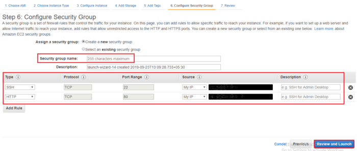

## What is an EC2 instance?

* An EC2 instance is nothing but a virtual server in Amazon Web services terminology.
* It stands for Elastic Compute Cloud.
* It is a web service where an AWS subscriber can request and provision a compute server in AWS cloud.

## To create an AWS EC2 instance

* Step 1 : Launching EC2 instance

* Step 2 : Choose an image (Amazon Linux AMI):

* Step 3 : Choose a Instance Type (t2 micro)

* Step 4 (optional) : Setup a web server to allow Internet traffic to reach the instance 

* Step 5 : Create a new key pair to securely connect to the instance via SSH

* Step 6 : Connect to the instance

        ssh -i keypair.pem ec2-user@<'EC2-Instance-Public-IPv4-Address'>
