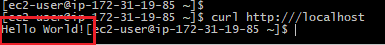

## Setup a docker in the AWS instance

### Once we are connected to the EC2 instance :

Install docker by using

        sudo yum install -y docker

Run the image by using :

        docker run -d -p 80:8080 chandupriya/nodedemo:0.1

If the following message is printed, the docker container is running

